# Documento de Visão do Produto
## Plataforma de Gestão de Aprendizagem (EduFlow LMS)

---

## 1. Visão Geral do Produto

### 1.1 Declaração do Problema e Oportunidade de Negócio

O crescimento da educação a distância e do treinamento corporativo digital ampliou o acesso à qualificação profissional e acadêmica, mas também evidenciou desafios relacionados ao acompanhamento e à permanência dos participantes. Sem ferramentas adequadas, esse cenário resulta em fragmentação de informações, falta de escala e uma experiência de aprendizado prejudicada. Nesse contexto, estudos apontam que instituições de ensino enfrentam desafios no acompanhamento do desempenho dos alunos, sendo a evasão um dos problemas mais críticos decorrentes dessa falta de estrutura adequada (MARQUEZ, 2025).

Esse problema tem raízes na ausência de uma plataforma centralizada de gestão de aprendizagem. Instituições que dependem de ferramentas dispersas para controle acadêmico e administrativo enfrentam dificuldades para manter a consistência e a rastreabilidade das informações. Agrava-se ainda mais quando consideramos que a transição para o ensino remoto ou híbrido exige não apenas a aquisição de hardware e software adequados, mas também a implementação de um sistema de gestão de aprendizagem escalável que possa integrar ferramentas educacionais como plataformas de videoconferência, fóruns de discussão e repositórios de conteúdo digital (PEARSON, 2024). Além disso, a falta de mecanismos automáticos de acompanhamento impede que professores e gestores identifiquem rapidamente alunos com dificuldades ou em risco de evasão (MARQUEZ, 2025).

Diante desse cenário, a demanda por soluções estruturadas de gestão da aprendizagem tem crescido de forma acelerada. Relatórios recentes indicam que o mercado global de Sistemas de Gestão de Aprendizagem (LMS) foi estimado em aproximadamente USD 36,9 bilhões em 2026, com projeção de crescimento anual composto de 18,6% até 2035, demonstrando expansão consistente da demanda por plataformas integradas de ensino e treinamento (BUSINESS RESEARCH INSIGHTS, 2026).

É nesse contexto que o EduFlow LMS apresenta viabilidade comercial ao oferecer uma solução centralizada que integra conteúdos, avaliações e monitoramento de desempenho em um único ambiente digital, atendendo tanto instituições educacionais quanto organizações empresariais que buscam eficiência, escalabilidade e suporte à tomada de decisão baseada em dados.

Além da viabilidade comercial, a adoção do EduFlow pode gerar impactos significativos tanto do ponto de vista educacional quanto econômico. Para instituições de ensino, a centralização da gestão de cursos e o acompanhamento automático do progresso dos alunos contribuem diretamente para a redução da evasão, que gera impacto econômico estimado em mais de R$ 130 bilhões anuais no Brasil (GEEKIE, 2025).

No contexto corporativo, ao substituir treinamentos presenciais por um ambiente digital, é possível reduzir custos relacionados a deslocamento, hospedagem e aluguel de espaço, além de reaproveitar conteúdos, tornando a capacitação mais econômica e eficiente a longo prazo. Plataformas LMS também oferecem escalabilidade, permitindo capacitar equipes distribuídas geograficamente sem perder o controle sobre a qualidade do ensino (DOT GROUP, 2025).

Para além dos benefícios econômicos, do ponto de vista social, plataformas LMS ampliam o acesso à educação e à qualificação profissional, democratizando o aprendizado para públicos que não teriam acesso a formações presenciais. Em relação à diferenciação no mercado, o EduFlow se destaca por integrar em um único ambiente funcionalidades como criação de conteúdo, avaliações, fórum de discussão, emissão de certificados e acompanhamento de progresso, oferecendo uma solução integrada que reduz complexidade operacional e aumenta a eficiência institucional frente a alternativas fragmentadas.

---

### 1.2 Perspectiva do Produto

O EduFlow LMS se insere em um ecossistema já consolidado de plataformas de gestão de aprendizagem. Soluções como o Moodle, plataforma de código aberto mais utilizada no mundo, atendem bem instituições com equipes técnicas para customização, mas exigem infraestrutura própria e conhecimento especializado para implantação. O Google Classroom, por sua vez, é amplamente adotado pela sua simplicidade e integração com o ecossistema Google, porém não é considerado um LMS completo, pois carece de recursos avançados de gestão pedagógica, como avaliações estruturadas, emissão de certificados e acompanhamento detalhado de progresso. Já a Udemy se posiciona como um marketplace de cursos, voltado à venda de conteúdos para o público geral, sem oferecer às instituições controle sobre seus próprios alunos e estrutura curricular. O EduFlow se diferencia por oferecer um ambiente institucional completo e independente, que combina criação de conteúdo, avaliações, fórum, acompanhamento de progresso e emissão de certificados em uma única plataforma, sem depender de infraestrutura técnica especializada.

Essa proposta é direcionada a dois segmentos principais: instituições de ensino como escolas, faculdades e cursos livres e organizações empresariais que necessitam capacitar equipes de forma estruturada. As partes interessadas incluem administradores institucionais, responsáveis pela configuração e gestão da plataforma; professores, responsáveis pela criação e condução dos cursos; alunos, que consomem os conteúdos e realizam avaliações; gestores de RH e coordenadores pedagógicos, que acompanham o desempenho das equipes e turmas; e mantenedores das instituições, interessados na eficiência operacional e nos resultados da plataforma.

Para todos esses perfis, a proposta de valor do EduFlow está na centralização de todo o ciclo de aprendizagem em um único ambiente acessível, reduzindo a dependência de ferramentas externas e oferecendo às instituições maior controle, rastreabilidade e eficiência na gestão do ensino.

---

### 1.3 Capacidades do Produto

O EduFlow LMS oferece um conjunto integrado de funcionalidades que atendem às necessidades de ensino e treinamento digital, garantindo eficiência, rastreabilidade e experiência de usuário consistente.

**Principais funcionalidades:**

- **Gestão de instituições, cursos e módulos:** criação, edição e organização de instituições, cursos, módulos e aulas, permitindo que professores e administradores estruturem o conteúdo de forma lógica e progressiva.
- **Upload e gerenciamento de materiais:** suporte a vídeos e PDFs, centralizando todo o conteúdo educacional em um único ambiente.
- **Avaliações e certificação:** criação de avaliações de múltipla escolha com cálculo automático de notas e emissão de certificado ao concluir o curso.
- **Monitoramento do progresso:** registro automático de aulas concluídas e notas de avaliações, permitindo que professores e gestores acompanhem o desenvolvimento dos alunos.
- **Fóruns de discussão:** espaço para interação entre alunos e professores, esclarecimento de dúvidas e debates sobre os conteúdos do curso.
- **Matrícula e gestão de usuários:** cadastro de professores e alunos e gerenciamento de matrículas nos cursos pela administração da instituição.

---

**Wireframes de baixa resolução:**

#### Visão do Usuário (Aluno)

| Dashboard | Aula |
| :---: | :---: |
| 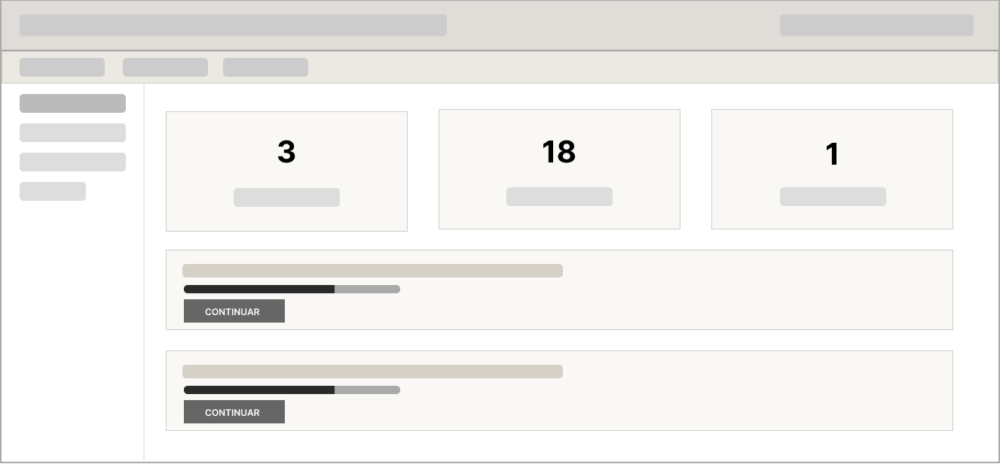 | 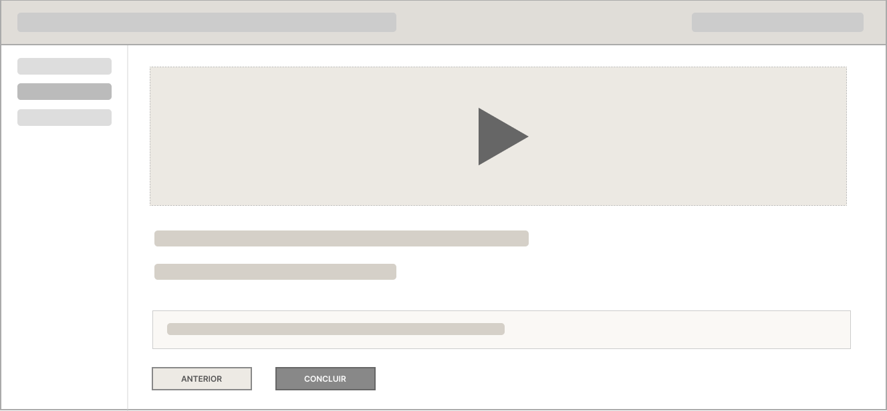 |
| **Avaliações** | **Forum** |
| 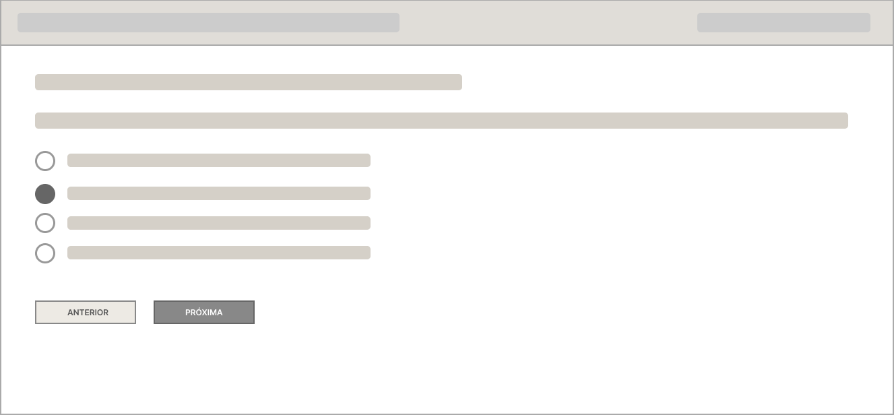 | 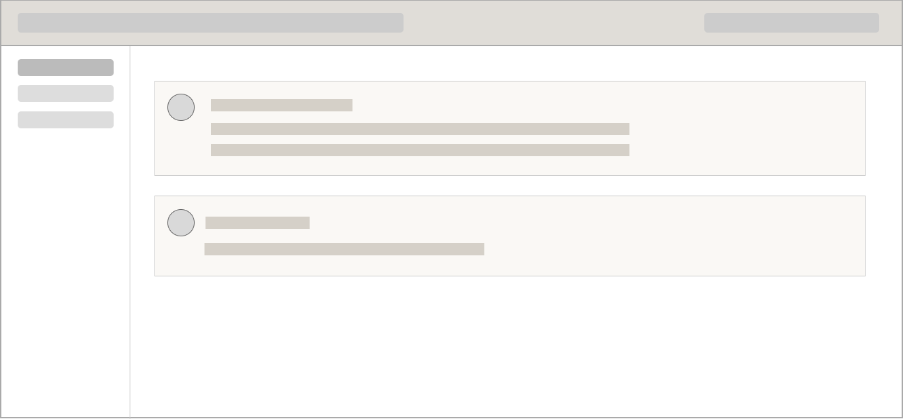 |

#### Visão do Professor

| Dashboard | Aula |
| :---: | :---: |
| 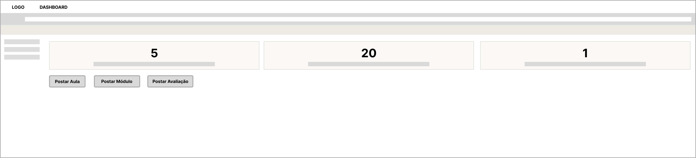 | 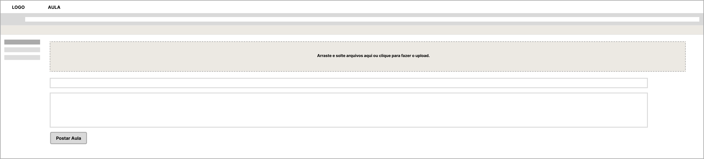 |
| **Avaliações** | **Desempenho dos Alunos** |
| 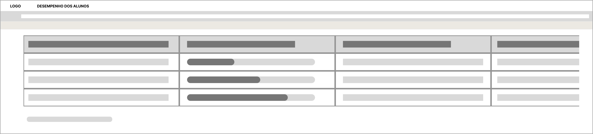 | 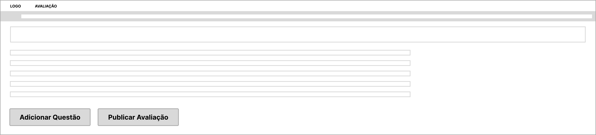 |

#### Visão do Administrador

| Painel de Controle | Usuários |
| :---: | :---: |
| 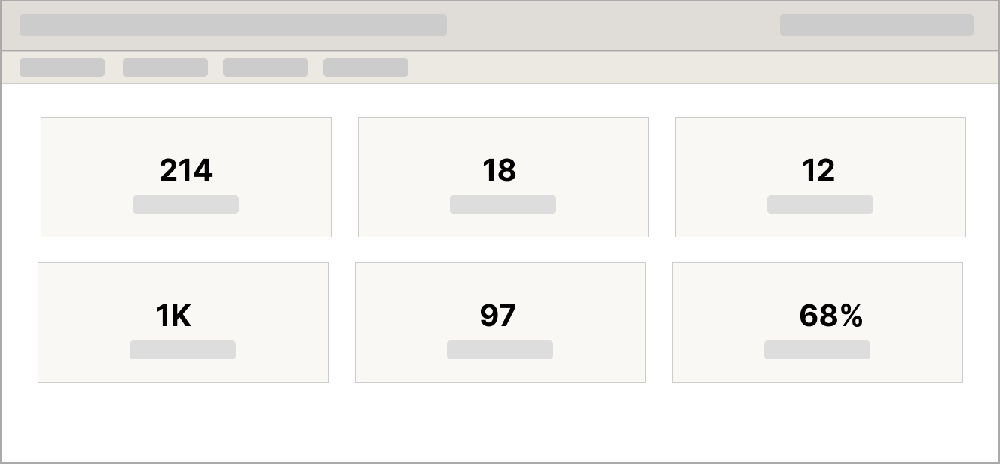 | 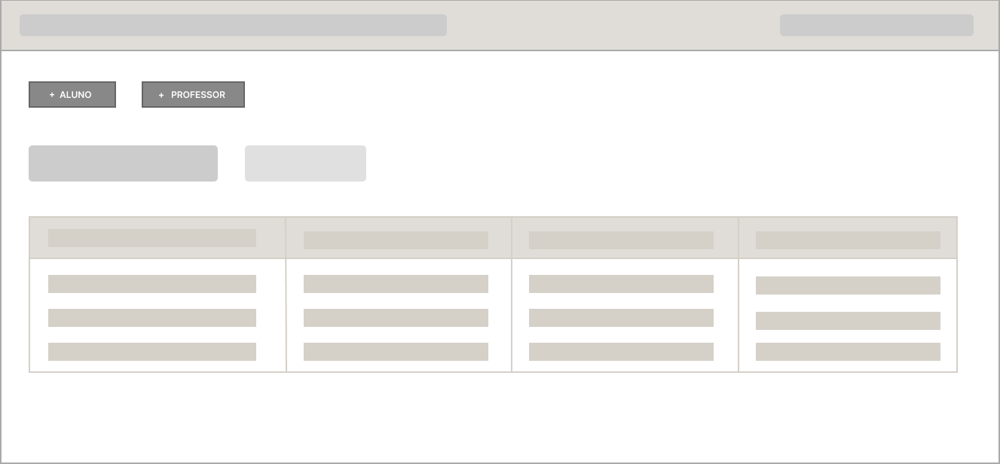 |
| **Criar Curso** | **Gerenciar Matricula** |
| 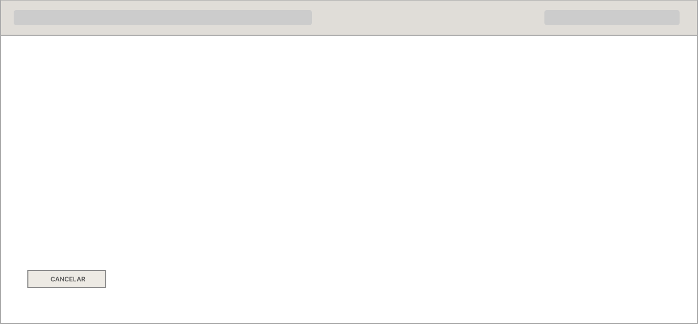 | 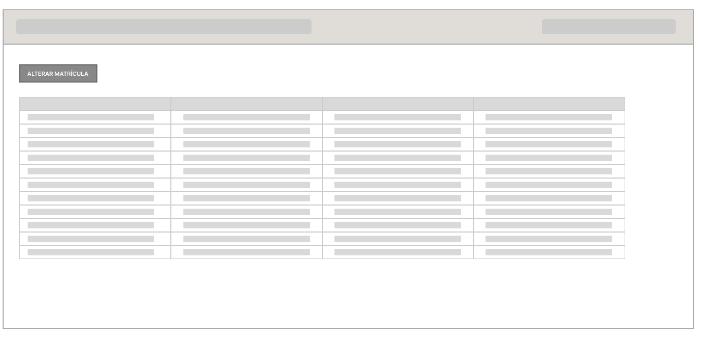 |

---

**Características de qualidade:**

- **Usabilidade:** interface intuitiva e fácil navegação, permitindo que qualquer perfil de usuário opere o sistema sem necessidade de treinamento prévio.
- **Segurança:** controle de acesso baseado em perfis — aluno, professor e administrador — com autenticação por login e senha e isolamento de dados entre instituições.
- **Confiabilidade:** sistema estável e disponível especialmente nos horários de maior uso, com salvamento automático de respostas de avaliações para evitar perda de progresso.
- **Manutenibilidade:** estrutura modular que permite atualização de funcionalidades sem comprometer a operação do sistema.
- **Escalabilidade:** capacidade de atender entre 1.000 e 5.000 usuários ativos mensais, com suporte a streaming de vídeos por serviço externo dedicado.

---

## 2. Descrição dos Usuários

Os usuários do EduFlow LMS possuem diferentes níveis de permissão e interagem com o sistema de maneiras distintas, focando na administração, no ensino ou no aprendizado. Abaixo estão detalhados os perfis baseados no padrão ISO/IEC/IEEE 29148:2011.

| Atributo | Descrição |
| :--- | :--- |
| **Usuário ID** | USER-001 |
| **Nome do Perfil** | Administrador da Instituição |
| **Descrição** | Responsável pela gestão macro da instituição dentro da plataforma. |
| **Experiência Técnica** | Média; facilidade com navegação em sistemas web e gestão de painéis administrativos. |
| **Frequência de Uso** | Regular a Alta (dependendo do volume de novas turmas e alunos). |
| **Principais Objetivos** | Criar/configurar a instituição, gerenciar cadastros (professores e alunos), criar cursos, alocar professores, gerenciar matrículas e analisar relatórios de uso. |
| **Desafios** | Gerenciar grandes volumes de dados (como cadastros em lote) e garantir que as permissões estejam corretas. |
| **Restrições** | Gerencia toda a instituição, mas não possui permissão para criar ou editar o conteúdo pedagógico dos cursos. |
| **Requisitos Principais** | RF01, RF02, RF03, RF08. |

 

| Atributo | Descrição |
| :--- | :--- |
| **Usuário ID** | USER-002 |
| **Nome do Perfil** | Professor |
| **Descrição** | Profissional de educação responsável por estruturar e ministrar o conteúdo. |
| **Experiência Técnica** | Baixa a Média; precisa de uma interface intuitiva para não ter dificuldades com o upload de arquivos. |
| **Frequência de Uso** | Alta; atualizações frequentes de aulas, criação de avaliações e acompanhamento do fórum. |
| **Principais Objetivos** | Criar módulos e aulas, fazer upload de materiais (vídeos/PDFs), criar avaliações, monitorar o progresso dos alunos e responder dúvidas no fórum. |
| **Desafios** | Organizar o conteúdo de forma clara e manter o engajamento dos alunos nas aulas a distância. |
| **Restrições** | Possui acesso e visão apenas aos cursos aos quais foi formalmente atribuído como professor. |
| **Requisitos Principais** | RF03, RF04, RF05, RF09. |

 

| Atributo | Descrição |
| :--- | :--- |
| **Usuário ID** | USER-003 |
| **Nome do Perfil** | Aluno |
| **Descrição** | Consumidor final do conteúdo oferecido pela instituição. |
| **Experiência Técnica** | Variável (Baixa a Alta); o sistema deve ser extremamente amigável para englobar qualquer nível de familiaridade tecnológica. |
| **Frequência de Uso** | Alta; acessos diários ou semanais para estudos. |
| **Principais Objetivos** | Assistir aulas, baixar materiais, realizar avaliações, acompanhar o próprio progresso, interagir no fórum e emitir certificados. |
| **Desafios** | Manter-se motivado, não perder o progresso em caso de queda de internet e organizar sua rotina de estudos. |
| **Restrições** | Acesso restrito exclusivamente aos conteúdos dos cursos em que está matriculado. |
| **Requisitos Principais** | RF06, RF07, RF09, RF10. |

---

## 3. Restrições do Projeto e do Produto

Com base nos requisitos não funcionais e na arquitetura esperada para o LMS, foram identificadas as seguintes restrições, baseadas no padrão IEEE-830:

| Campo | Descrição |
| :--- | :--- |
| **Restrição ID** | NF-CONST-001 |
| **Título** | Restrição de Hospedagem de Vídeos (Integração) |
| **Descrição** | O sistema não deve hospedar os vídeos nativamente em seu próprio servidor de banco de dados/aplicação. Deve ser feita a integração com um serviço de armazenamento externo especializado em streaming de vídeos (ex: AWS S3, Vimeo, YouTube corporativo). |
| **Origem** | Requisitos Não-Funcionais / Arquitetura de Software |
| **Critérios de verificação e validação** | a. A tentativa de upload de um vídeo deve encaminhar o arquivo diretamente para o serviço externo via API.   b. O player do curso deve consumir o vídeo a partir da URL do serviço externo. |
| **Relacionamento** | Relaciona-se com RF04 (Upload de materiais). |

 

| Campo | Descrição |
| :--- | :--- |
| **Restrição ID** | NF-CONST-002 |
| **Título** | Isolamento de Dados e Segurança de Acesso |
| **Descrição** | O sistema deve garantir que dados de uma instituição sejam invisíveis para outras. Além disso, alunos e professores devem acessar estritamente os cursos vinculados aos seus perfis por meio de login e senha. |
| **Origem** | Requisitos de Segurança |
| **Critérios de verificação e validação** | a. Testes de intrusão e de autorização devem falhar caso um aluno tente acessar via URL direta um curso no qual não tem matrícula. |
| **Relacionamento** | Relaciona-se com a segurança básica (RNF). |

 

| Campo | Descrição |
| :--- | :--- |
| **Restrição ID** | NF-CONST-003 |
| **Título** | Capacidade e Escalabilidade |
| **Descrição** | O banco de dados e a infraestrutura devem suportar o volume projetado para o primeiro ano: aproximadamente 500 cursos, 10.000 matrículas e de 1.000 a 5.000 usuários ativos por mês sem queda de performance. |
| **Origem** | Requisitos de Negócio (Volume de dados esperado) |
| **Critérios de verificação e validação** | a. Testes de carga simulando acessos simultâneos de alunos em horários de pico. |
| **Relacionamento** | Relaciona-se com RNF de Estimativa de usuários e Disponibilidade. |

---

## 4. Análise de Riscos e Mitigação

Abaixo estão listados os principais riscos do projeto EduFlow, mapeados a partir dos desafios técnicos do estudo de caso, usando a estrutura baseada no padrão IEEE-830:

| Campo | Descrição |
| :--- | :--- |
| **ID do Risco** | RISCO-001 |
| **Descrição** | Lentidão e instabilidade no sistema devido ao acesso simultâneo de vídeos pesados por múltiplos alunos. |
| **Categoria** | Técnico / Infraestrutura |
| **Probabilidade** | Alta |
| **Impacto** | Alto (Pode inviabilizar o uso do sistema durante os horários de aula). |
| **Ação de Mitigação** | Utilizar APIs de serviços externos otimizados para streaming de vídeo com suporte a CDN (Content Delivery Network). |
| **Plano de Contingência** | Oferecer a opção para o aluno baixar o vídeo em menor resolução ou acessar a transcrição em texto da aula temporariamente. |

 

| Campo | Descrição |
| :--- | :--- |
| **ID do Risco** | RISCO-002 |
| **Descrição** | Perda do progresso do aluno em uma avaliação no caso de queda de conexão ou falha no navegador. |
| **Categoria** | Técnico / Experiência do Usuário (UX) |
| **Probabilidade** | Média |
| **Impacto** | Alto (Gera enorme frustração e sobrecarga no suporte técnico). |
| **Ação de Mitigação** | Implementar uma funcionalidade de "auto-save" (salvamento automático) via cache local do navegador ou requisições assíncronas constantes ao banco de dados durante a prova. |
| **Plano de Contingência** | Permitir que o professor reinicie a tentativa de avaliação do aluno manualmente. |

 

| Campo | Descrição |
| :--- | :--- |
| **ID do Risco** | RISCO-003 |
| **Descrição** | Dificuldade por parte dos professores na organização e estruturação dos conteúdos de forma clara. |
| **Categoria** | Usabilidade |
| **Probabilidade** | Média |
| **Impacto** | Médio (Afeta a qualidade do ensino e a satisfação do aluno). |
| **Ação de Mitigação** | Desenvolver uma interface (UX/UI) altamente intuitiva, baseada em "arrastar e soltar" (drag and drop) e fornecer templates sugeridos para estruturação de módulos. |
| **Plano de Contingência** | Disponibilizar uma base de conhecimento (tutoriais) e um canal de suporte focado na integração de novos professores (onboarding). |

 

| Campo | Descrição |
| :--- | :--- |
| **ID do Risco** | RISCO-004 |
| **Descrição** | Baixo engajamento e alto índice de abandono dos cursos por parte dos alunos matriculados. |
| **Categoria** | Negócio / Usuário |
| **Probabilidade** | Alta |
| **Impacto** | Alto (Ameaça a eficácia do LMS e os indicadores da instituição). |
| **Ação de Mitigação** | Integrar um sistema de envio de e-mails para notificações automáticas, lembretes de prazos, gamificação simples (barras de progresso) e emissão de certificados imediatos. |
| **Plano de Contingência** | Geração de relatórios de inatividade permitindo à instituição contatar os alunos faltosos proativamente. |

---

## Referências

BUSINESS RESEARCH INSIGHTS. **Learning Management System (LMS) Market**. 2026. Disponível em: https://www.businessresearchinsights.com/pt/market-reports/learning-management-system-lms-market-117797. Acesso em: 01 mar. 2026.

DOT GROUP. **LMS para Educação Corporativa Digital**. 2025. Disponível em: https://dotgroup.com.br/blog/guia-completo-lms-para-educacao-corporativa-digital/. Acesso em: 01 mar. 2026.

GEEKIE. **IA e redução da evasão escolar: guia para escolas**. 2025. Disponível em: https://www.geekie.com.br/inteligencia-artificial-reducao-evasao-escolar-inteligencia-artificial/. Acesso em: 01 mar. 2026.

MARQUEZ, Laura Ferreira. **EduFlow: Análise do desempenho acadêmico de estudantes universitários utilizando técnicas de Visualização de Informação**. Dissertação (Mestrado em Ciência da Computação) – Universidade Federal de Uberlândia, Uberlândia, 2025. Disponível em: https://repositorio.ufu.br/bitstream/123456789/46754/1/EduFlowAnaliseDesempenho.pdf. Acesso em: 01 mar. 2026.

PEARSON. **10 desafios da transição para o ensino digital e como superá-los**. 2024. Disponível em: https://hed.pearson.com.br/blog/higher-education/10-desafios-da-transicao-para-o-ensino-digital-e-como-supera-los. Acesso em: 01 mar. 2026.
