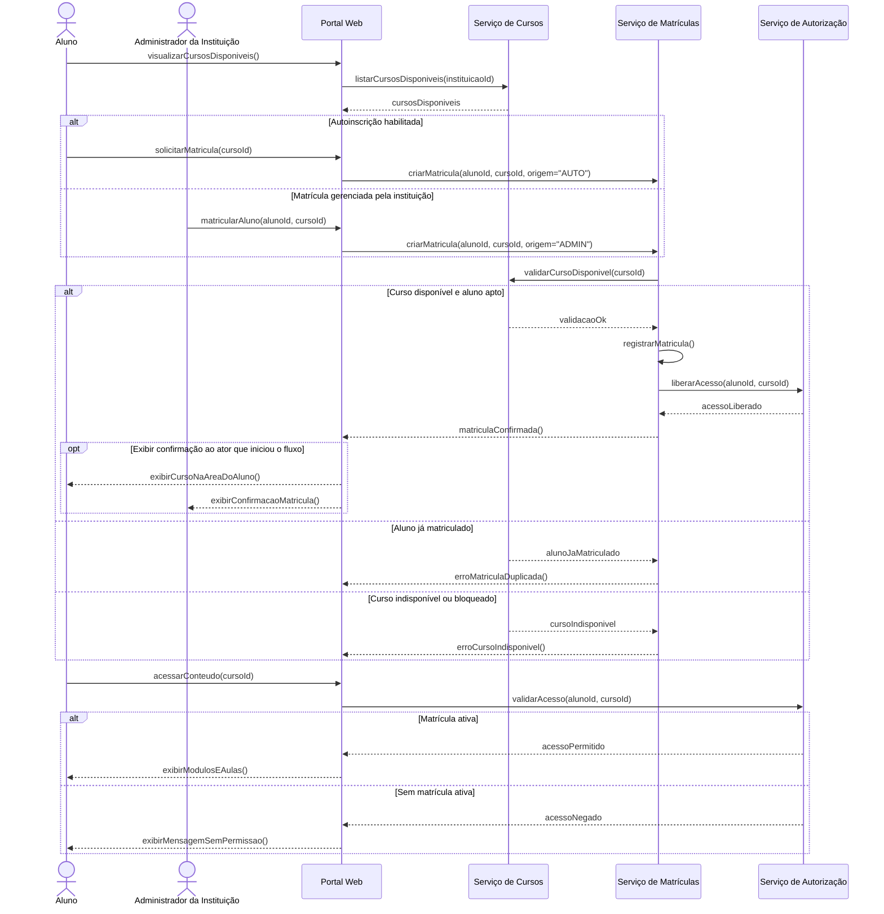

# 03 — Modelagem comportamental da Fatia 1

## Fatia 1 — Matrícula do aluno em curso e liberação de acesso ao conteúdo

**Histórias cobertas:** US-ADM-006, US-ALU-001, US-ALU-002 e US-ALU-003.

Escolhemos **diagrama de sequência** para esta fatia porque ela envolve coordenação entre mais de um ator e mais de um subsistema. O fluxo atravessa a interface, a lógica de matrícula, a validação do curso e a liberação de acesso ao conteúdo, além de possuir caminhos alternativos conforme a origem da matrícula e a existência de restrições de acesso.

## Diagrama de sequência

## Observação

O foco deste diagrama não é mostrar telas isoladas, mas sim a sequência ponta a ponta que transforma um aluno sem acesso em um aluno matriculado com acesso liberado ao conteúdo do curso.