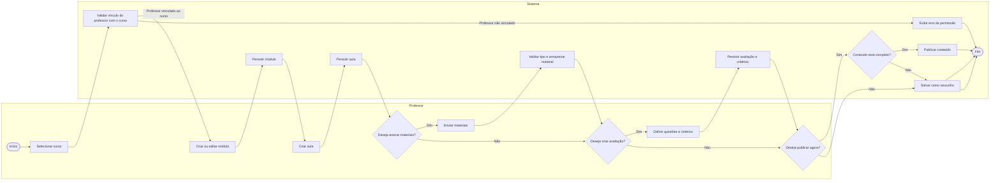

# 03 — Modelagem comportamental da Fatia 2

## Fatia 2 — Professor cria, organiza e publica o conteúdo do curso

**Histórias cobertas:** US-PED-001, US-PED-002, US-PED-003, US-PED-004, US-PED-005, US-PED-006 e US-PED-007.

Escolhemos **diagrama de atividades** para esta fatia porque ela representa melhor um fluxo de trabalho com decisões sucessivas: criação de módulo, criação de aula, upload de materiais, criação de avaliação, definição de critérios e decisão entre publicar ou manter em rascunho. Além disso, a notação com raias ajuda a separar claramente o que é ação do professor e o que é responsabilidade do sistema.

## Diagrama de atividades

## Observação

Neste fluxo, a publicação só acontece quando o sistema considera que o conteúdo está em condição válida para ficar visível aos alunos. Caso contrário, o conteúdo permanece salvo como rascunho, respeitando a regra de que materiais incompletos não devem ser publicados.