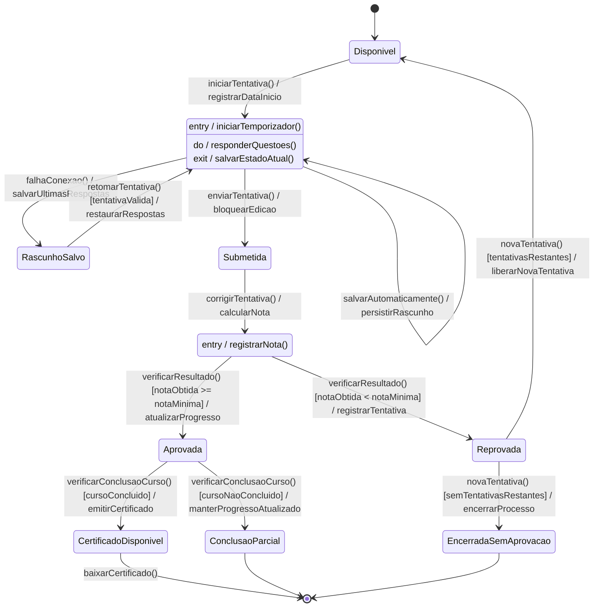

# 03 — Modelagem comportamental da Fatia 3

## Fatia 3 — Aluno realiza avaliação, tem o progresso registrado, recebe nota e obtém certificado

**Histórias cobertas:** US-ALU-004, US-ALU-005, US-ALU-006, US-ALU-007, US-ALU-008 e US-ALU-010.

Escolhemos **diagrama de estados** para esta fatia porque ela envolve uma entidade com ciclo de vida bem definido: a tentativa de avaliação. Esse fluxo possui estados claros, transições disparadas por eventos, caminhos de exceção e regras de decisão que afetam nota, progresso e eventual liberação do certificado.

## Diagrama de estados

## Observação

O estado modelado aqui é o da **tentativa de avaliação**, mas ele também funciona como gatilho para atualizar o progresso do curso e, quando todos os critérios são atendidos, liberar a emissão do certificado ao aluno.